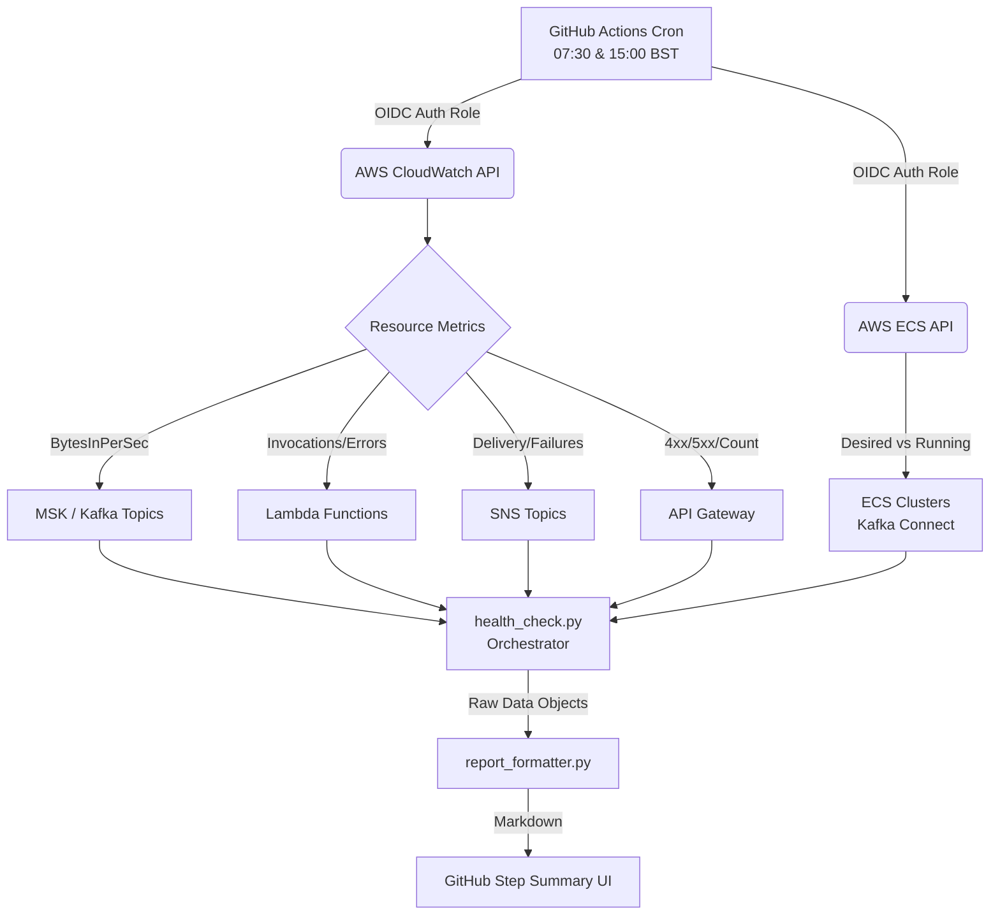

```mermaid
graph TD
    A[GitHub Actions Cron <br> 07:30 & 15:00 BST] -->|OIDC Auth Role| B(AWS CloudWatch API)
    A -->|OIDC Auth Role| ECS(AWS ECS API)
    
    B --> C{Resource Metrics}
    C -->|BytesInPerSec| D[MSK / Kafka Topics]
    C -->|Invocations/Errors| E[Lambda Functions]
    C -->|Delivery/Failures| F[SNS Topics]
    C -->|4xx/5xx/Count| H[API Gateway]
    
    ECS -->|Desired vs Running| G[ECS Clusters <br> Kafka Connect]
    
    D & E & F & G & H --> I[health_check.py <br> Orchestrator]
    I -->|Raw Data Objects| J[report_formatter.py]
    J -->|Markdown| K[GitHub Step Summary UI]
```
